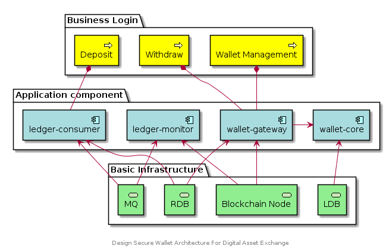

## Design Secure Wallet Architecture For Digital Asset Exchange
As a cryptocurrency enthusiast and a part of blockchain industry builder, I will try my best to make the offort to build the cryptocurrency ecosystem better. In the post, I will share my experience on how to design a secure cryptocurrency wallet module for digital asset exchange. Wish it will help to build business bases on blockchain and crypto economy. If is there any other better solution, please don't hesitate to give feedback.

Digital Asset management are crucial, especially for institutions those business build on blockchain. A typical usage case is crypto exchange or over the counter trade platform (OTC), many thousands of traders withdraw or depisit their digital asset without the limitation of time and space, bank-level security and hight available architecture is the basic requirement for start the business.
### Hot Wallet Warm Wallet And Cold Wallet
Common knowledge of wallet would not introduce in the post, but we should learn the three kinds of wallets between exchange business system.
- Host Wallet: Be used only for send transaction from system, should keep sufficient but not too much amount of funded to service withdrawals. It should have tight policies limiting the amount of coin, that's to say small amount withdrawals should as automate as possible but large funded withdrawals should require admin approval before withdrawed coins can be sent.
- Warm Wallet: Be used for all deposits to system, request an address to send funds to when a new users joins. Customers recharge funds to Warm wallet should be withdrawed to cold wallet automatly or regularly in time.
- Cold wallet: Be used for storing the most of fund of system, at least 7/10 as i think, and recharging funds for Warm wallet. Cold wallet is also refer as offline wallet, because it's intended to be run on a device which doesn't connect to any network.

In conclustion, **private keys to be stored securely, smart risk control withdraw system and deposit onchain confirmation are three key considerations when we talking about design philosophy of crypto wallet system architecture**. If we have to make priority of those security factors for develoment, the importances of those keys gradual reduction by the conclustion above listed, the most important is private key storing.
### Architecture Based On Actually Usage Case
Holding their own private keys is the main reason to embrace cryptocurrency. Currency transference is cumbersome by traditional finance way, especially Cross-border remittances. There are many differences business logic between individual or institutions when using digital asset wallet. **Online service where import pubkic keys keeps track of transaction and balance, and every time need to send coin, signing service signs the transaction**.

How to design digital asset wallet module dependents on where private keys you store. There are three modes basically: Store private key in mobile phone, blockchain full-node or secure network program environment.
1. Decentralized mobile APP wallet holds  the key and signs raw transaction. when wallet create by mobile app, the pubkic key is registered to network program (webservices mostly). network program interacts with p2p network to get information from blockchain ledger (maintain UTXO, query Ethereum accounts balance and tx nonce, transactions history etc..) and broadcast new transactions. Those onchain wallets satisfy most personal usage.
2. Blockchain node with wallet provides full-service, directly creates and signs raw transaction in network environment. System integration with full-service node manages wallets by JSON-RPC interacted with blockchain full node. The wallets private keys are stored together with blockchain ledger, meanwhile, exposed to the less secure open network environment. There are many hacked cases caused by JSON-RPC connections, like: [Holy shit my eth accounts been hacked](https://www.reddit.com/r/ethereum/comments/3ird55/holy_shit_my_eth_accounts_been_hacked/), [揭秘以太坊中潜伏多年的“偷渡”漏洞，全球黑客正在疯狂偷币](https://paper.seebug.org/547/). I think using the original wallet implemented by blockchain node is the bad practice. Someone suggested that bitcoin-core should separate Node and wallet from functions: [[enhancement] Separate Node and Wallet functions](https://github.com/bitcoin/bitcoin/issues/7525) and there is a refator pull request: [Refactor: separate wallet from node #10973](https://github.com/bitcoin/bitcoin/pull/10973)
3. To increase security, private keys can be generated and stored by a separate wallet program operating during a more secure environment, we call it **signing program**. Another part of the full-service is **network program** that construct raw transactions and broadcast signed transactions. The complete process is that network program creates unsigned transactions and transfers the unsigned transactions to signing program by sucure way (QRcode or any other secure transport protocol), and then signing program gives the signed transactions back to the networked program, finally the networked program broadcasts the signed transactions to the peer-to-peer network.

### Signing Program And Network Program
The chapter is the key point of the post. There are four components of wallet full-service.
- The first is wallets management, the private keys are generated by **wallet-core**(Signing program) program and stored by levelDB
- The second is external endpoints, withdrawal process and wallet generation, **wallet-gateway**(network program) constructs raw transactions and provides external endpoint for business system, transport data by using gRPC protocol between wallet-core and wallet-gateway components.
- The third component is **ledger-monitor** program, which subscribes best block(new block) event and push to MQ(RabbitMQ).
- The last is **ledger-consumer**, which combines with two MQ consumers, one is maintain UTXOs for our system wallets(UTXOs base blockchain) and the other is deposits handle consumer(users notifications).

