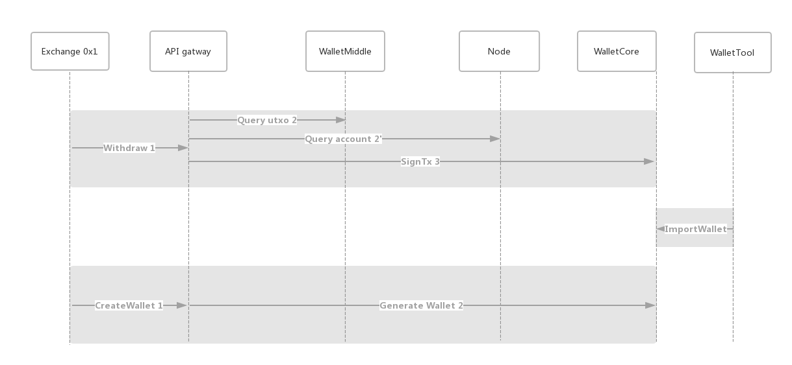
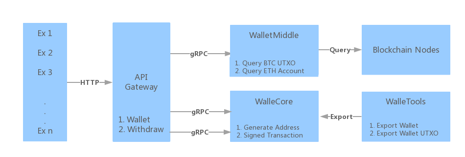

## 钱包服务独立模块架构设计
### 服务类型
0. 区块链节点服务
  - 开放 JSON-RPC 接口
1. 钱包辅助工具
  - 从节点导出钱包
2. 钱包核心服务
  - 生成钱包接口
  - 钱包签名接口
3. 钱包辅助服务
  - 查询 UTXO 接口 (UTXO base blockchain, such as bitcoin)
  - 查询 Account 接口 (Account base blockchain, such as ethereum)

### 业务流程

### 服务体系结构

